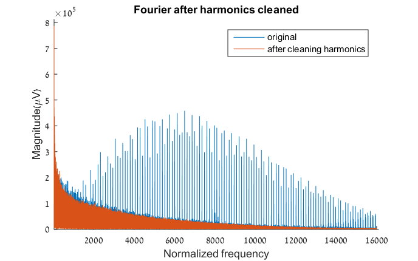

# Neural Recording Signal Processing Machine Learning Spike Sorting

A signal processing spike sorting pipeline for nauralynx extracellular neural recordings

## Absract

This code consists is an analysis of extra-cellular recording of neurons in the rat hippocampus with the goal of identifying and classifying individual neurons firing from the raw signal, also known as Spike Sorting. The neural recordings constitute a signal of voltage over time on 16 different channels, each channel records from a 17 micron wire implanted in the a rodent hippocampus. Given the 32 KHz resolution of the recording across 16 channels, 1 second of recording generates 0.5 million 32bit integer samples per second. This amount of data necessitates the use of techniques in signal filtering and dimensionality reduction. For this project I process and analyze 60 seconds of recording utilizing Fourier transforms, high-pass filtering, PCA (SVD), and K-Means clustering. After applying these techniques I we able to clean and process the recording sufficiently to where it is possible to clearly identify the signatures of 3 distinct neurons.

## Background

 A typical neuron firing, also called an Action Potential, occurs on the time order of 1-3 milliseconds, with a voltage on the order of 70-150 millivolts when observed from within the cell, and 70-150 microvolts when observed extracellularly. Given the amount of noise when trying to observe a biological signal on this voltage scale, signal processing is immensely useful in discerning neural activity.

## Input Data

The input data for this project comes from the lab of Dori Derdikman, of the Technion medical faculty, whose work focuses on the function of memory and spatial mapping in the Hippocampus region of the brain. One of the lab's focuses is the study of Place Cells, a particular set of neurons in the rat hippocampus. These neurons are active only when the rat is in a particular 2D coordinate in an enclosure, encompassing the mechanism by which the rat stores a location mentally.

Recordings of these neurons are made by implanting 17 micron-thick electrode wires into the rat's hippocampus near the neurons and measuring the voltage. The recordings are made from 16 electrodes at a sample rate of 32 KHz. The recording equipment (Neuralynx – Cheetah) saves the data as a raw binary which I converted to 32bit unsigned integers using Java code contained here. After storing the data in an ascii, comma-separated-value format, the rest of the processing is done in Matlab.

*60 seconds of 16 channels of voltage recordings from the neurons of a rat hippocampus. To obtain this recording, preprocessing was done by writing a java script to read form a binary file produced by the recording equipment.*

*Input zoomed in. Another plot of the raw input zooming in to about 3 seconds of recording.Since a neuron action potential spike is on the order of 1-3ms with an extra cellular voltage of about 70-150 microvolts, it is clear that there is still a lot of unwanted noise in this signal.*

## Cleaning and Filtering

A typical extracellular recording of a neuron shows a voltage spikes of around 100 microvolts and about 1-3 milliseconds in length. Due to noise from other electro-chemical activity in the brain and errant electric activity from the recording process, cleaning and filtering is necessary. The two main methods used are manipulation in the Fourier domain and a High Pass Butterworth filter.

The Fourier transform decomposes a function of time (signal) into the fundamental frequencies that make it up. The Fourier transform is a complex-valued function of frequency, whose absolute value represents the amount of that frequency present in the original function, the complex argument is the phase offset of the basic sinusoid in that frequency. A fourier transform is considered to be the frequency domain representation of the original signal. Harmonics occur when a frequency is an integer multiple of another frequency causing an additive effect in the energy of the source signals, this is common in electronic circuitry. Observing harmonics in a biological signal is usually considered noise generated in the recording process. To remove these harmonics, I wrote code to take the average value for every 100 samples (3ms), and look for spikes more than 3 times the mean (a customized moving average filter). The following is the result after changing those values to the mean.

*Fourier of signal after removing harmonics. From the plot, it appears that some information was is lost in the cleaning process, however, the amount of loss is minimal compared to the noise energy removed.*

## High Pass Filtering

In order to be able to observe neuronal activity in the range of events on the order 1-3 ms, further cleaning of the signal is required. To accomplish this, a High Pass filter, specifically a Butterworth filter, is utilized. Essentially a high pass filter allows higher frequencies beyond a threshold to remain, while attenuating all frequencies below. In this case, I wanted to attenuate frequencies below 600 Hz because those frequencies in the signal directly interfered with voltage crests 0.8ms and longer, the range in which neuronal activity occurs. This also removes typical electronics oscillation in the 50 Hz range. The energy of these frequencies is high as seen in the original Fourier plot of the signal. I chose an implementation known as a Butterworth filter, which is characterized by a magnitude response that is maximally flat in the passband. To make sure that filtering was effective I plotted the Fourier of the signal after the high pass filtering.

*High Passed filter in Fourier domain. Looking at the Fourier of the signal it is clear that the high pass filter is functioning properly, minimal frequency in the signal is in the range of 0-600Hz.*

*Channel 9 before and after harmonics cleaning and high pass filtering. Again it is clear the amount of noise and oscillation is significantly lower than the original input.*

*Channel 9 zoomed in after harmonics cleaning and high pass filtering. These peaks around 100 microvolts which are now visible are a clear indication of neuronal activity that I was looking for. This was verified by Derdikman Lab where the data came from.*

## Sampling and Compressing the Signal

Given the 32 KHz resolution of the recording process across all 16 channels, 1 second of recording generates 0.5 million 32bit integer. The objective of analyzing 60 seconds consisted of more than 30 million samples. In order to efficiently analyze this data compression is necessary. For this I use PCA, specifically the SVD method.  Prior to this however, it was necessary to create a data matrix of sample events to compress.

## Sampling

Before compression, I first create a collection of relevant samples of neuronal activity from the filtered channels. This is done by setting a voltage threshold for suspected neural activity, in this case 70 microvolts. Using the filtered channels as input, all samples on any channel surpassing the threshold, the entire set of values across all channels for 1ms before, to 2ms after are saved. This corresponds to the 3ms upper bound of the typical neuron action potential cycle time. Saving data across all channels is done to see correlation between channels during the clustering phase. In order to avoid saving a specific peak multiple time, a 1ms break between peaks per channel is enforced. Since neurons have a refractory period of around 10ms this is sensible, although if the channel happens to be picking up signals from multiple source neurons firing at once some activity could be missed. When this process is complete, for this dataset, we end up with a data matrix that is 1536x1603. 1603 samples x (3ms@32KHZ=96) x 16 channels in length.

## PCA-SVD Analysis and Compression

Principal Component Analysis uses an orthogonal transformation to decompose a set of possibly correlated sample signals into a set of linearly independent variables, called principal components, each representing a certain amount of variability within the data. A subset of these can be recombined to form a compressed version of the original signal. Because PCA maps information this way, it is highly useful in data analysis and compression. Specifically it allows quantization of data to a minimal set of coefficients to achieve a specific error bound. PCA can be done by eigenvalue decomposition of a data covariance matrix or singular value decomposition of a data matrix, which allows for non-square matrices and is considered the standard method. After forming the data matrix as described in the previous section, To decide how many pc vectors to use for compression, I consider the following plot showing the mean square error of the compressed signal to the original by the amount principal components used .

*MSE vs number of U vectors used to compress signal. Although 40 seems relatively high in MSE, experimentally it appeared to function well during the clustering phase.*

*Storage space before and after SVD. After utilizing SVD the size of the data matrix reduced to less than 5% of its original size.*

*Sample spike before and after compression. The sample before and after (using 40 u vectors out of 1603). It is apparent some information is lost, but the overall shape of the signal is quite similar. The average MSE for the samples is 63.77 after compression at this rate.*

## Clustering

Finding neural activity in a multi-channel cell recording involves more than identifying voltage spikes. The exact location of each wire in the electrode array used for recording with respect to the nearby neurons’ locations is unknown. A neuron between two electrodes may show up as two smaller spikes on different channels as opposed to a large spike on a single channel. For this reason, clustering of the samples across all channels is utilized to identify signitures of individual neurons.

## K-means

K-means clustering is a method of vector quantization. It aims to partition n observations into k clusters; each observation belongs to the cluster with the nearest mean.

*K-means clustering on SVD compressed signal. The six clusters produced by k-means.
Clustering is done on 16 channels simultaneously per sample. Each cluster shows the mean value of the signal, with std error bar, per channel. Also included is the number of samples per cluster, x axis is time index in frequency domain (32KHz), y axis is microvolts. Colors (top right) indicate clusters that are similar to each other. Although K-means was initialized to find 6 clusters, visually it appears that some clusters are very similar, so that possibly the data is better divided into 3 unique clusters.*

*Figure 18: Timing of K-means process on original vs after SVD. Compression using 40 out of the 1603 u vectors, time is significantly lower.*

## Conclusion

Clustering sample distribution on SVD compressed vs original. (time in x axis is the sample length of the sample). Clustering on the compressed data showed 5 distinct clusters as opposed to 6 on the uncompressed. Whether this is an indication that the compression is too lossy is a question I attempted to answer.

After cleaning, filtering, sampling, compressing, and clustering the data the results appear to show 3 unique clusters of signals, or three unique neuron signatures as I have interpreted it. Dori Derdikman's lab analysis shows 4 neurons, however they analyzed the full 31.25 minutes of recording while this analysis was done only over 60 seconds. It is very possible that the fourth neuron would be present if I analyzed the entire dataset. Although I we able to more or less identify the same neurons as Dori's lab, the motivation of the project was to see if it was possible to try to discern more in the signal than what is already being identified. It is possible that the two clusters that appear to look similar in the last figure, and clustering
boundaries in general, do actually signify distinct and brain activity. This potential is hard to investigate and needs to be done by association of cluster activity to the rodent's behavior. That being said, being able to come up with the same results as the current methods is a good first step.

For the future it would be interesting would be to do more analysis into clusters that do not initially appear to be of interest, to see if perhaps they in fact signify undescribed brain activity. This is the ultimate goal.
